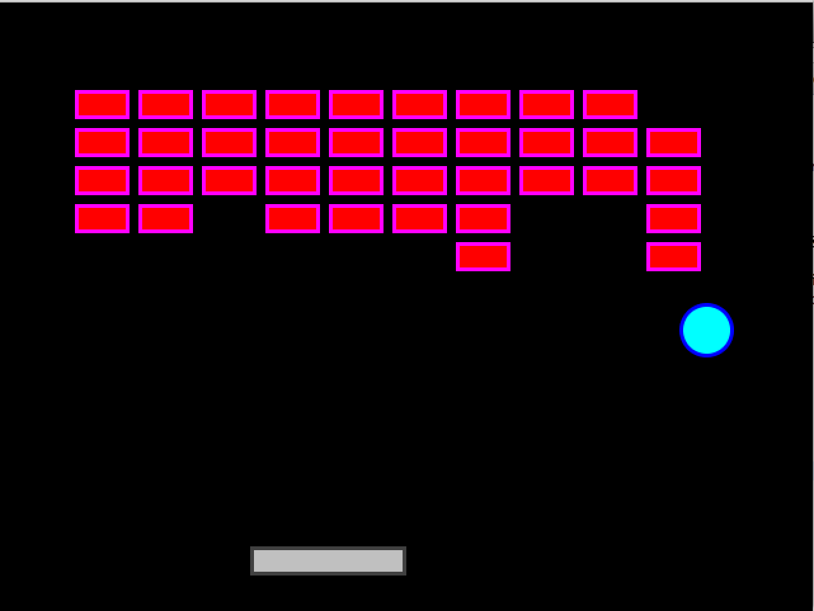
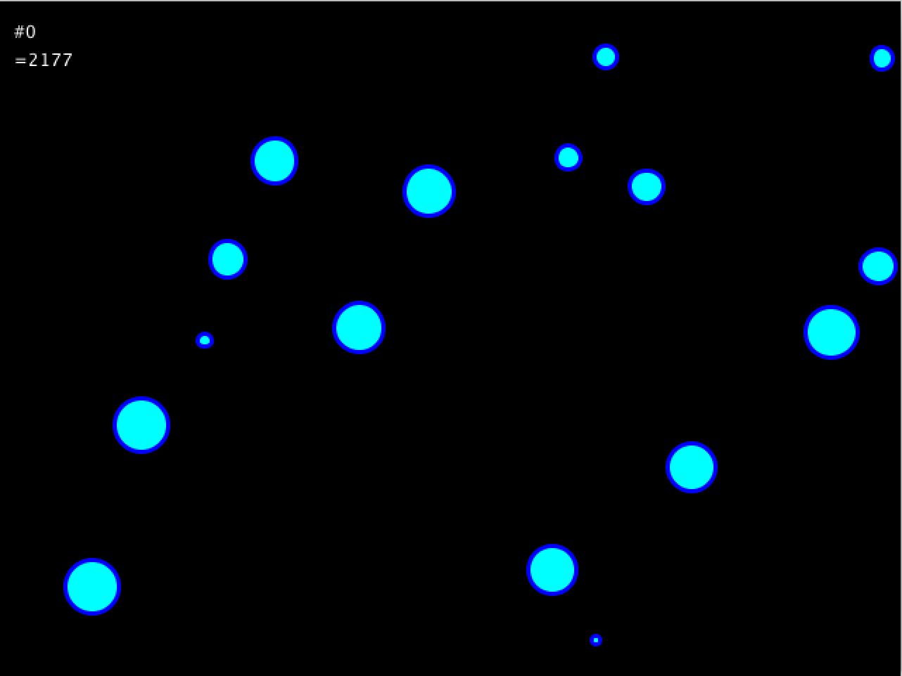

# Priori
A collision pre-detection library for fast moving 2d shapes in Java.

A common problem in games with collision detection is dealing with fast moving objects. 
Fast moving objects can skip over important collisions with other objects - or corners. 

Priori solves this problem by detection collisions before they occur. 
Priori is given the state of a physics simulation with the start and end positions of every moving object. 
It handles all potential intersections one at a time until all intersections are properly resolved and every object is moved to its end position.

Priori is also capable of estimating what time two objects will collide - independent of the current frame. 
Intersections store the collision, normal, contact point, and the time of intersection relative to the starting and ending positions of the two shapes.

Priori supports the following:
- Circle
- Axis-aligned rectangle
- Non-rotating plane
- Restitution (bounciness)
- Friction

Priori at the moment does *not* support the following:
- Rotating objects
- Polygons
- Line segments

Priori comes with a brute-force broad phase algorithm - but any spatial algorithm can be provided for finding potential collisions between shapes.

The project comes with two examples. One a breakout clone and the other is just a set of fast moving bouncing balls that stay on the screen.

